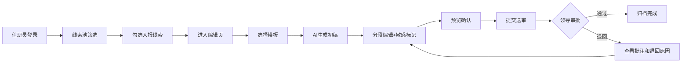

## 1. 产品概述
面向市县宣传部值班员的 Web 专报工作台，用于将分散在新闻站点、短视频平台、论坛和政务热线的涉本地舆情整合成规范的领导专报。系统覆盖"线索收集 → 智能编辑 → 送审归档"全流程，帮助夜班人员在半小时内完成一版规范专报。

## 2. 核心功能

### 2.1 用户角色
| 角色 | 登录方式 | 核心权限 |
|------|----------|----------|
| 值班员 | 账号密码/SSO | 筛选线索、编辑专报、提交送审、查看历史记录 |
| 审核领导 | 账号密码/SSO | 审批专报、批注意见、退回修改、查看版本差异 |

### 2.2 功能模块
1. **舆情线索池**：多维度筛选、来源分类、热度排序、批量勾选入报
2. **专报编辑**：三种模板选择、AI智能生成、分段编辑、敏感词标记、实时预览
3. **送审记录**：版本对比、领导批注、退回原因、审批状态流转

### 2.3 页面详情
| 页面名称 | 模块名称 | 功能描述 |
|-----------|-------------|---------------------|
| 舆情线索池 | 顶部筛选栏 | 时间范围、属地、涉事部门、热度等级、来源类型筛选 |
| 舆情线索池 | 线索卡片列表 | 按热度倒序展示，含标题、摘要、来源、评论数、转发数、热度标签 |
| 舆情线索池 | 批量操作栏 | 显示已选数量、一键全选/取消、转入编辑页 |
| 舆情线索池 | 线索详情抽屉 | 点击卡片展开完整内容、相关评论、传播路径 |
| 专报编辑 | 模板选择区 | 日报/突发快报/专题跟踪三种模板切换 |
| 专报编辑 | AI生成区 | 一键生成事件概述、传播情况、网民诉求、风险判断、处置建议 |
| 专报编辑 | 分段编辑区 | 五段式可编辑区域，每段支持独立修改、敏感词高亮、标记敏感 |
| 专报编辑 | 已选线索区 | 展示已勾选的线索列表，支持移除、排序 |
| 专报编辑 | 操作工具栏 | 保存草稿、预览PDF、提交送审 |
| 送审记录 | 记录列表 | 按时间倒序展示所有送审记录，含标题、模板类型、状态、提交时间 |
| 送审记录 | 版本对比 | 左右分栏对比不同版本内容差异，高亮增删改 |
| 送审记录 | 审批详情 | 领导批注时间线、退回原因、审批流转记录 |

## 3. 核心流程

值班员登录系统 → 进入线索池，筛选当日涉本地舆情 → 浏览线索卡片，勾选需入报内容 → 点击"生成专报"进入编辑页 → 选择专报模板 → 点击AI生成初稿 → 逐段修改文字，标记敏感表述 → 预览确认无误后提交送审 → 领导在送审记录中查看并审批/批注/退回 → 值班员根据退回意见修改后重新提交 → 审批通过归档

## 4. 用户界面设计

### 4.1 设计风格
- **主色调**：深蓝(#1e3a5f)作为政务系统主色，搭配藏青(#2c3e50)和警蓝(#34495e)
- **强调色**：橙色(#e67e22)用于热度标记、红色(#c0392b)用于高风险/敏感、绿色(#27ae60)用于已通过
- **中性色**：银灰背景(#f5f6fa)、白色卡片(#ffffff)、深灰文字(#2c3e50)
- **按钮风格**：直角微圆角(4px)、实心主按钮、描边次按钮
- **字体**：标题使用"Noto Serif SC"宋体体现正式感，正文使用"Noto Sans SC"黑体保障可读性
- **布局风格**：顶部导航 + 三栏式内容区（左侧筛选/侧边栏、中间主内容、右侧详情/操作区）
- **图标风格**：线性简约图标，统一使用lucide-react图标库

### 4.2 页面设计概览
| 页面名称 | 模块名称 | UI元素 |
|-----------|-------------|-------------|
| 舆情线索池 | 顶部筛选栏 | 深色筛选条、下拉选择器、日期范围、热度滑块 |
| 舆情线索池 | 线索卡片列表 | 卡片网格布局、热度渐变边框、来源彩色标签、数据统计徽标 |
| 舆情线索池 | 详情抽屉 | 右侧滑出、分层信息展示、评论折叠面板 |
| 专报编辑 | 模板选择 | 卡片式模板预览、选中态高亮边框、模板描述文字 |
| 专报编辑 | 编辑区域 | 五段式分区、每段独立工具栏、悬浮AI辅助按钮 |
| 专报编辑 | 敏感标记 | 黄色背景高亮、右键标记菜单、侧边敏感词统计 |
| 送审记录 | 记录列表 | 时间线布局、状态彩色徽章、版本号标识 |
| 送审记录 | 版本对比 | 左右分栏、diff差异高亮、行号对齐 |
| 送审记录 | 审批详情 | 批注气泡、时间戳、用户头像、审批流程图 |

### 4.3 响应式
- 桌面端优先设计（1920px最佳）
- 平板端：筛选栏折叠为可展开面板、卡片从3列变2列
- 移动端：仅保留核心列表浏览功能，编辑功能提示使用桌面端
