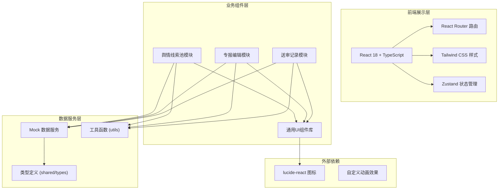

## 1. 架构设计



## 2. 技术说明
- **前端框架**: React@18 + TypeScript@5 + Vite@5
- **样式方案**: Tailwind CSS@3 + 自定义 CSS 变量主题
- **路由管理**: React Router DOM@6
- **状态管理**: Zustand@4（全局状态：选中线索、编辑中的专报、用户信息）
- **图标库**: lucide-react
- **后端服务**: 纯前端项目，使用 Mock 数据模拟后端接口
- **项目初始化**: vite-init react-ts 模板

## 3. 路由定义
| 路由 | 页面用途 |
|-------|---------|
| / | 重定向到 /clues |
| /clues | 舆情线索池 - 筛选、浏览、勾选涉事舆情 |
| /edit | 专报编辑页 - 模板选择、AI生成、分段编辑、敏感标记 |
| /review | 送审记录 - 历史列表、版本对比、领导批注查看 |

## 4. 数据模型

### 4.1 核心类型定义

```typescript
// 舆情线索
interface Clue {
  id: string;
  title: string;
  summary: string;
  content: string;
  source: 'news' | 'video' | 'forum' | 'hotline';
  sourceName: string;
  author: string;
  publishTime: string;
  location: string;
  departments: string[];
  heatLevel: 1 | 2 | 3 | 4 | 5;
  commentCount: number;
  shareCount: number;
  viewCount: number;
  comments: Comment[];
  isSensitive: boolean;
  tags: string[];
}

// 评论
interface Comment {
  id: string;
  author: string;
  content: string;
  publishTime: string;
  likes: number;
  isSensitive: boolean;
}

// 专报模板类型
type ReportTemplate = 'daily' | 'urgent' | 'topic';

// 专报内容段落
interface ReportSection {
  key: 'overview' | 'spread' | 'demands' | 'risk' | 'suggestion';
  title: string;
  content: string;
  sensitiveMarks: SensitiveMark[];
}

// 敏感标记
interface SensitiveMark {
  id: string;
  startIndex: number;
  endIndex: number;
  text: string;
  level: 'warning' | 'danger';
  note?: string;
}

// 专报
interface Report {
  id: string;
  title: string;
  template: ReportTemplate;
  clueIds: string[];
  sections: ReportSection[];
  creator: string;
  createdAt: string;
  updatedAt: string;
  version: number;
  status: 'draft' | 'pending' | 'approved' | 'rejected';
}

// 审批记录
interface ReviewRecord {
  id: string;
  reportId: string;
  version: number;
  reviewer: string;
  reviewerRole: string;
  action: 'submit' | 'approve' | 'reject' | 'comment';
  comment: string;
  createdAt: string;
}

// 筛选条件
interface FilterParams {
  timeRange: [string, string] | null;
  locations: string[];
  departments: string[];
  heatLevels: number[];
  sources: Clue['source'][];
  keyword: string;
}
```

## 5. 项目目录结构

```
src/
├── components/           # 通用组件
│   ├── Layout/          # 布局组件（导航、侧边栏）
│   ├── ClueCard.tsx     # 线索卡片
│   ├── FilterBar.tsx    # 筛选栏
│   ├── SectionEditor.tsx # 段落编辑器
│   ├── TemplateCard.tsx # 模板选择卡片
│   ├── StatusBadge.tsx  # 状态徽章
│   └── DiffViewer.tsx   # 版本对比组件
├── pages/               # 页面组件
│   ├── CluesPage.tsx    # 舆情线索池
│   ├── EditPage.tsx     # 专报编辑页
│   └── ReviewPage.tsx   # 送审记录页
├── store/               # Zustand 状态
│   └── appStore.ts      # 全局状态
├── data/                # Mock 数据
│   ├── clues.ts         # 线索数据
│   ├── reports.ts       # 专报数据
│   └── reviews.ts       # 审批记录数据
├── shared/              # 共享类型
│   └── types.ts         # 类型定义
├── utils/               # 工具函数
│   ├── diff.ts          # 文本差异对比
│   └── format.ts        # 格式化工具
├── App.tsx              # 应用入口
├── main.tsx             # 渲染入口
└── index.css            # 全局样式
```

## 6. 状态管理设计

Zustand store 包含以下状态：
- `selectedClueIds: string[]` - 已勾选的线索ID列表
- `currentReport: Report | null` - 当前编辑中的专报
- `filterParams: FilterParams` - 当前筛选条件
- `userInfo: { name: string; role: string }` - 当前登录用户

主要 actions：
- `toggleClue(id: string)` - 勾选/取消勾选线索
- `setFilterParams(params)` - 更新筛选条件
- `createReport(template)` - 基于已选线索创建专报
- `updateSection(key, content)` - 更新专报段落
- `addSensitiveMark(sectionKey, mark)` - 添加敏感标记
- `submitReport()` - 提交送审
